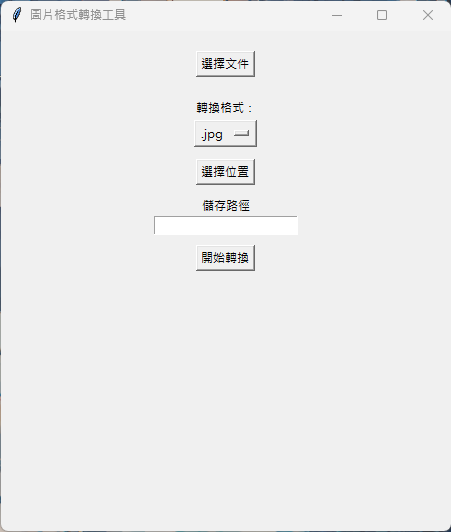

# 圖片格式轉換工具

這個程式是一個使用 Tkinter 建立的 GUI 工具，用於將圖片進行格式轉換。使用者可以選擇要轉換的圖片，指定轉換後的儲存路徑和格式，然後進行轉換操作。

## 功能簡介

- 選擇圖片：透過按鈕選擇要進行格式轉換的圖片。
- 指定轉換格式：使用下拉選單選擇轉換後的圖片格式（.jpg、.png、.jpeg、.webp）。
- 選擇儲存路徑：使用者可以選擇轉換後的圖片儲存的路徑。
- 開始轉換：按下按鈕開始執行圖片格式轉換。
- 預覽轉換：在轉換後，可以在程式中預覽轉換後的圖片。

## 範例演示



## 如何使用

1. 在終端機或命令提示字元中，執行程式檔案 `image_converter.py`。

2. 程式視窗將會開啟，包含以下功能按鈕：
   - `選擇文件`：選擇要進行格式轉換的圖片。
   - `轉換格式`：下拉選單，選擇轉換後的圖片格式。
   - `選擇位置`：按下按鈕以瀏覽並選擇儲存路徑。
   - `開始轉換`：按下按鈕開始執行圖片格式轉換。
   - `預覽`：在轉換後，程式會在此區域顯示轉換後的圖片預覽。

3. 點擊 `選擇文件` 按鈕，選擇要進行格式轉換的圖片。

4. 使用 `轉換格式` 下拉選單，選擇你希望的轉換後的圖片格式。

5. 在 `儲存路徑` 文本輸入框中，手動輸入或按下 `選擇位置` 按鈕選擇轉換後的圖片儲存路徑。

6. 點擊 `開始轉換` 按鈕，程式將根據你的設定進行圖片格式轉換。

7. 轉換完成後，你可以在 `預覽` 區域看到轉換後的圖片。

## 執行要求

- Python 3.x 版本
- Tkinter 庫
- PIL (Python Imaging Library) 庫

## 安裝步驟

1. 使用 `git clone` 命令或下載 ZIP 壓縮檔，將程式複製到您的電腦中。

2. 在命令提示字元中，進入程式所在的資料夾。

3. 執行以下指令，安裝必要的套件：
    ```
    pip install tkinter
    ```

    ```
    pip install pillow
    ```

4. 執行以下指令，以執行程式：
    ```
    python image_converter.py
    ```

## 授權資訊

這個程式遵循 [MIT 授權](LICENSE.txt)，您可以自由使用、修改和分享這個程式。
